  

 

**Agentic shopping assistant — shops within your rules, buys only with your approval.**

[Live Demo](https://yunoclaw.tech/demo) · [Join Waitlist](https://yunoclaw.tech/waitlist) · [How It Works](https://yunoclaw.tech/how-it-works)

---

## What is YunoClaw?

YunoClaw is an AI-powered agentic shopping assistant that searches, evaluates, and ranks products against your exact constraints — budget, merchant, delivery deadline, and trust. Unlike traditional shopping tools, it doesn't just suggest — it acts. And it never buys without your explicit approval.

---

## Features

**🔍 Multi-source Search**
Queries multiple merchants and product catalogues simultaneously. One intent, one search — no more opening 12 tabs.

**⚙️ Hard Constraint Enforcement**
Budget ceiling, delivery deadline, preferred merchants, blocked brands. These are hard rules, not soft preferences. If a product doesn't fit, it's out.

**🧠 Ranked & Explained Results**
Every candidate is scored by rating, trust, delivery speed, and price fit. You see exactly why each result was chosen — no black box.

**🛡️ Approval-Gated Purchasing**
Nothing is bought without your explicit go-ahead. The agent proposes. You decide. Always.

**⚡ Machine Speed Research**
What takes an hour of manual research takes YunoClaw under a second. Structured evaluation across dozens of sources.

**🏪 Direct Merchant Redirect**
When you approve, you go straight to the product page. Checkout stays on the merchant's site — YunoClaw never touches your payment.

**🧩 Memory & Preferences**
Learns your preferences over time, refining evaluations to match your standards and past decisions.

---

## Use Cases

| Intent | Example |
|--------|---------|
| Gifts under budget | *"Birthday gift for a tech person under $80, delivered by Friday"* |
| Tech accessories | *"Best wireless mouse under $100, 2-day delivery"* |
| Urgent buying | *"Phone charger today — under $25, same-day delivery only"* |
| Repeated purchases | *"Reorder my usual coffee pods — best current price"* |
| Household replacements | *"Replace my broken blender — under $60, 4+ stars"* |

---

## Contributing

See [CONTRIBUTING.md](./CONTRIBUTING.md) for guidelines.

---

## License

[MIT](./LICENSE) © 2026 YunoClaw
